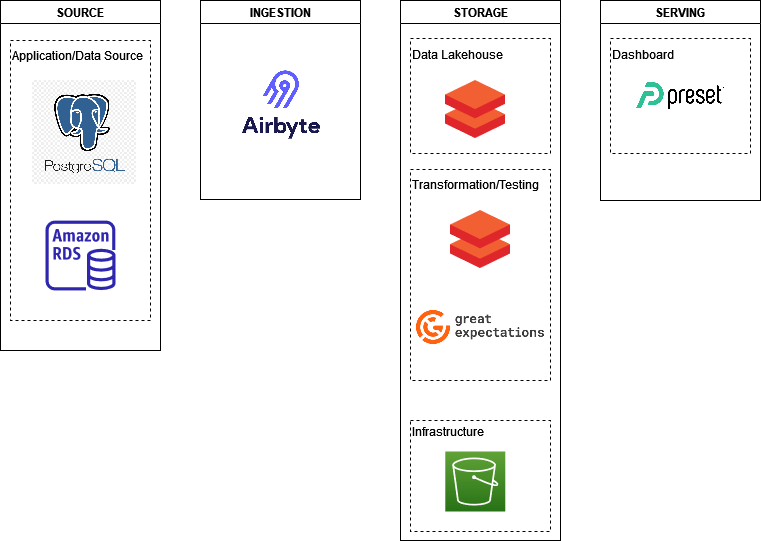
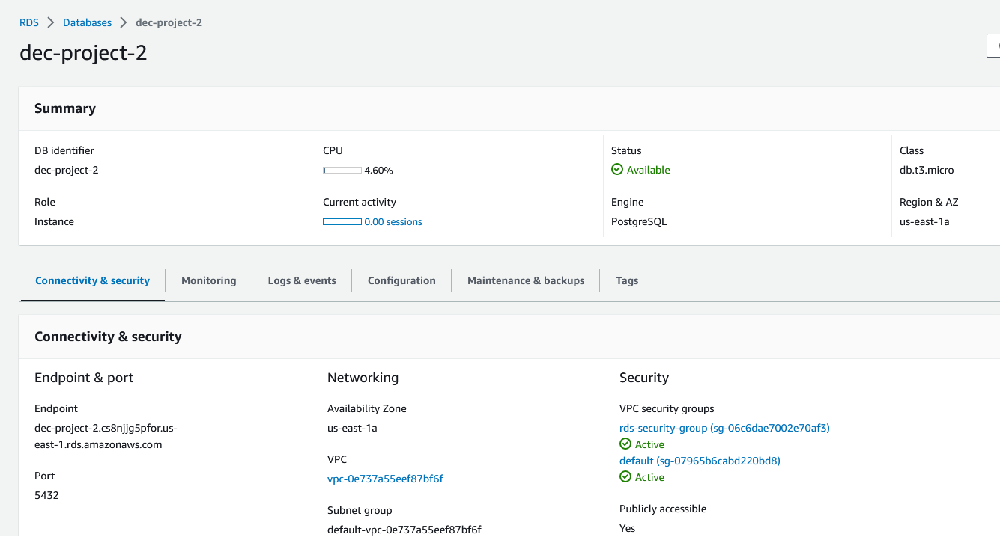
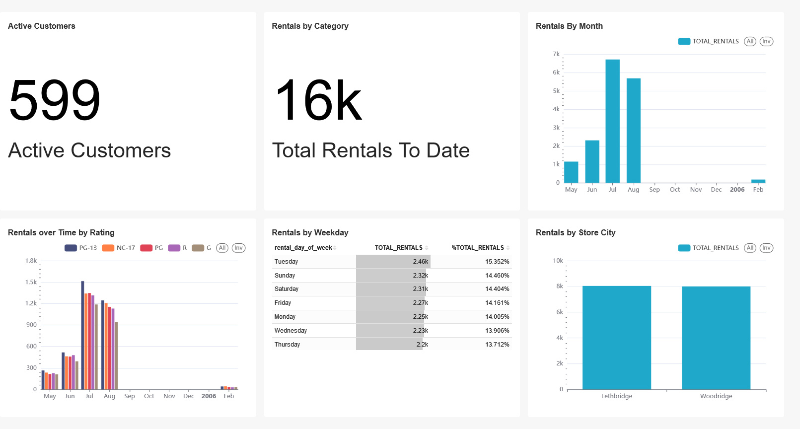

# dec_dvdrental
Data Engineering Camp Project 2

## 1. OBJECTIVE
Create an ELT pipeline moving data from the sample <a href="https://www.postgresqltutorial.com/postgresql-getting-started/postgresql-sample-database">DVD rental PostgreSQL database</a> to Databricks where we curate tables that can be used for reporting and insights.

## 2. SOLUTION ARCHITECTURE

## 3. DIMENSIONAL MODEL
TBD-insert screenshot

## 4. APPROACH
### Hosting DVD rental database on RDS
We created an RDS instance as shown to host the PostgreSQL database

### Creating a Databricks workspace
TBD

### Data Ingestion using Airbyte
TBD

### Data Curation
1. Airbyte syncs raw tables (bronze) into our Databricks workspace
2. We created notebooks which curate the (silver) tables shown in section 3. DIMENSIONAL MODEL
3. We also created a notebook to curate a One Big Table (gold) to serve as a datasource for our Preset dashboard

### Workflows
TBD

## 5. VISUALIZATION
We have created a <a href="https://efe6400f.us2a.app.preset.io/superset/dashboard/9/?native_filters_key=o98dQ_AqNUVy7Zn6i-ZBS1lqSgPF7V8kZBJ0Umb5bpjrHXT82eRA_ww8DPkj0MMW">Preset dashboard</a> to visualize key metrics that we created in the semantic layer, such as total_customers, active_customers, total_rentals, and total_films_rented

   
