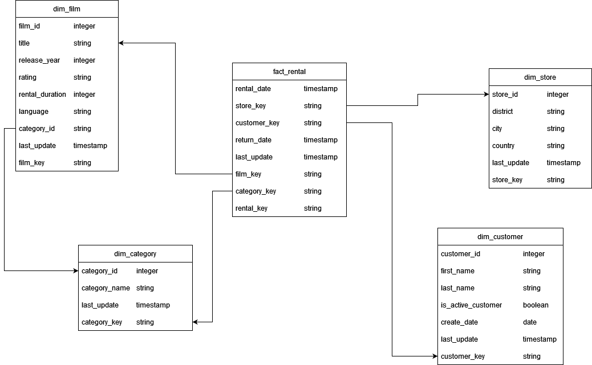
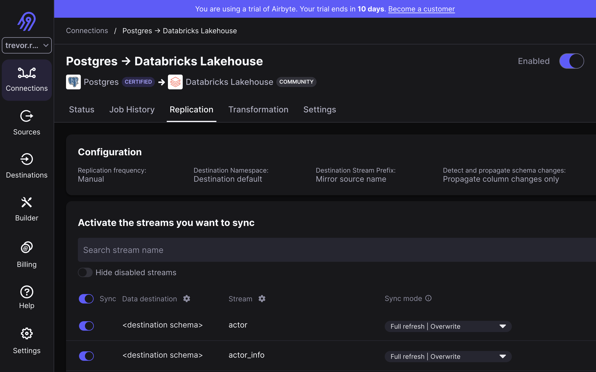
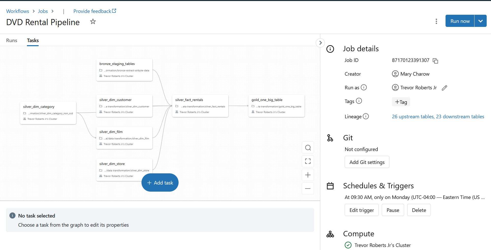
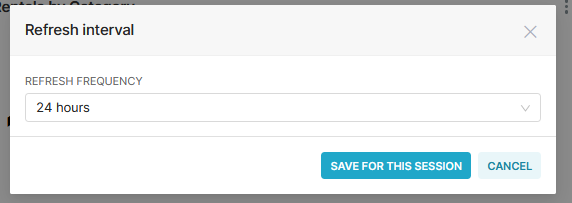

# dec_dvdrental
Data Engineering Camp Project 2

## 1. OBJECTIVE
Create an ELT pipeline moving data from the sample <a href="https://www.postgresqltutorial.com/postgresql-getting-started/postgresql-sample-database">DVD rental PostgreSQL database</a> to Databricks where we curate tables that can be used for reporting and insights.

## 2. SOLUTION ARCHITECTURE


## 3. DIMENSIONAL MODEL


## 4. APPROACH
### Hosting DVD rental database on RDS
We created an RDS instance as shown to host the PostgreSQL database


### Creating a Databricks workspace
We used the Databricks Quickstart wizard to create required IAM roles and policies for Databricks to successfully manage our metastore on Amazon S3.

The AWS IAM policy allows read-write access to the AWS S3 bucket in our team's account where the Databricks Metastore is hosted.

**IAM Policy**
```json
{
    "Version": "2012-10-17",
    "Statement": [
        {
            "Action": [
                "s3:GetObject",
                "s3:PutObject",
                "s3:DeleteObject",
                "s3:ListBucket",
                "s3:GetBucketLocation",
                "s3:GetLifecycleConfiguration",
                "s3:PutLifecycleConfiguration"
            ],
            "Resource": [
                "arn:aws:s3:::databricks-workspace-stack-e1455-dec-project-metastore-bucket/*",
                "arn:aws:s3:::databricks-workspace-stack-e1455-dec-project-metastore-bucket"
            ],
            "Effect": "Allow"
        },
        {
            "Action": "sts:AssumeRole",
            "Resource": "arn:aws:iam::442044547909:role/databricks-workspace-stack-e1455-dec-project-metastore-role",
            "Effect": "Allow"
        }
    ]
}
```
The AWS IAM trust relationship policy allows Unity Catalog to assume the permissions listed above and perform required read/write operations in the metastore bucket.

**IAM Role Trust Policy**
```json
{
    "Version": "2012-10-17",
    "Statement": [
        {
            "Effect": "Allow",
            "Principal": {
                "AWS": "arn:aws:iam::414351767826:role/unity-catalog-prod-UCMasterRole-14S5ZJVKOTYTL"
            },
            "Action": "sts:AssumeRole",
            "Condition": {
                "StringEquals": {
                    "sts:ExternalId": "2b52eb4b-441b-4032-8f54-c3d3db3d1a21"
                }
            }
        },
        {
            "Effect": "Allow",
            "Principal": {
                "AWS": "arn:aws:iam::442044547909:root"
            },
            "Action": "sts:AssumeRole",
            "Condition": {
                "StringEquals": {
                    "AWS:PrincipalArn": "arn:aws:iam::442044547909:role/databricks-workspace-stack-e1455-dec-project-metastore-role",
                    "sts:ExternalId": "2b52eb4b-441b-4032-8f54-c3d3db3d1a21"
                }
            }
        }
    ]
}
```

### Data Ingestion using Airbyte
We used Airbyte to ingest data from PostgreSQL to Databricks Lakehouse
The **Source** was the RDS PostgreSQL instance that we loaded the DVD Rental dataset to
The **Destination** was the Databricks metastore generated by the Databricks Quickstart
The replication is full overwrite as pictured in this Airbyte screenshot.



### Data Curation
1. Airbyte syncs raw tables to a landing zone in our Databricks workspace
2. We created a notebook (bronze) to extract the _airbyte_data column from the tables required for our model
3. We created notebooks which curate the (silver) tables shown in section 3. DIMENSIONAL MODEL
4. We also created a notebook to curate a One Big Table (gold) to serve as a datasource for our Preset dashboard
5. Data quality tests were run on all silver tables

### Workflows
We configured a Job in Databricks to run all required notebooks, including needed dependencies. 
The job is scheduled to run automatically on Mondays at 9:30am EST.



## 5. VISUALIZATION
We have created a <a href="https://efe6400f.us2a.app.preset.io/superset/dashboard/9/?native_filters_key=o98dQ_AqNUVy7Zn6i-ZBS1lqSgPF7V8kZBJ0Umb5bpjrHXT82eRA_ww8DPkj0MMW">Preset dashboard</a> to visualize key metrics that we created in the semantic layer, such as active_customers and total_rentals.

The dashboard is scheduled to auto-refresh every 24 hours.





## 6. NEXT STEPS/BACKLOG
A few items that would require further tweaking or we had hoped to complete as part of initial scope but ran out of time:
1. We did not configure the advanced connection in Preset to read from a different catalog, so all silver table scripts include a step to copy over data into hive_metastore for Preset to read
2. We added in a separate bronze notebook which writes the raw Airbyte data into staging tables, but did not refactor our silver table scripts to use these tables (only fact_rentals uses these staging tables)
3. We originally wanted dim_category to be a slow-changing dimension table, but ran out of time to implement recommended approach so kept it as a non-SCD table
4. We normally would configure incremental data inggestion with Airbyte. Due to the static nature of the data, we did not. The incremental ingestion can be configured later for datasets that change more often.
